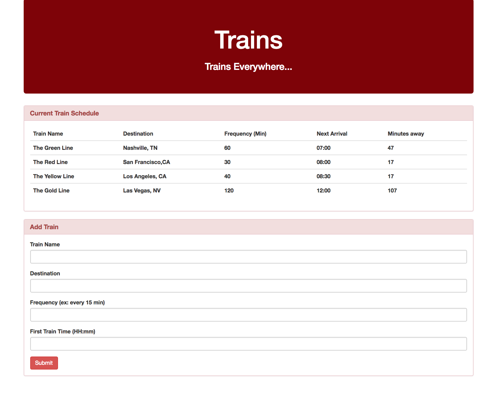

# Train-Tracker

This is a train tracker, in which collects data from your train station and displays the times, and schedules of upcoming trains.
Using FireBase to collect and store data from the users input. 

// Psuedocode notes put throughout to understand functionality of specific areas of code. //

<a href="https://blonded.github.io/Train-Tracker/" alt="DEMO"> "DEMO" </a>

Installing
Download repository on GitHub, open in preferred text editor to view source code (i.e. Atom, Sublime, Visual Studio Code). Open index.html, style.css, and train.js. Right click on the html file code and select "view in default browser" to view a demo of the website created. (Google Chrome Preferred for viewing)

index.html
style.css
train.js
js /folder
css         /folder
assets      /folder
images      /folder
LICENSE
README.md

Sample of code used:

javascript, moment JS
This code used moment JS to calculate the time of the train and how many minutes there was left 
until the next train arrived. 

''''''
     

        .......
// train start time
    var trainStartTime = moment().hours(splitTIme[0]).minutes(splitTIme[1])
    var minutesDifference = moment().diff(trainStartTime, "minutes")
    var remainder = minutesDifference % childSnapshot.val().frequency
    var minuteUntil = childSnapshot.val().frequency - remainder

'''''

## Built With

* [html]
* [css]
* [javascript]
* [jQuery]
* [BootStrap]
* [Firebase]
* [Moment JS]

## Authors

* **Lena Martinson** - *Github* - [Github](https://github.com/Blonded)
* **BootStrap** - *Bootstrap* - [BootStrap](https://getbootstrap.com/)
* **Firebase** - *FireBase* - [FireBase](https://firebase.google.com/)

